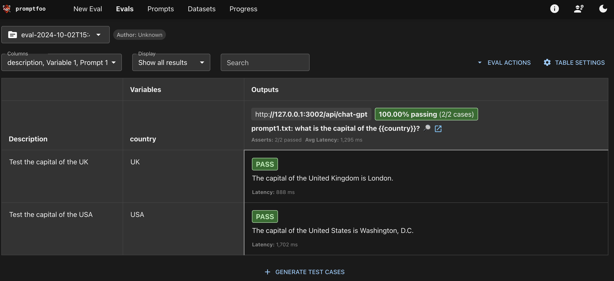

# Prompt Testing with Promptfoo
The simple example of testing prompts with promptfoo. 



As we can see, evaluating LLMs is very similar to test-driven development in software. In fact, we can test not only the responses to prompts but also the configurations related to the providers.

## Quick Start
- [ ] Install `npm` on your machine
- [ ] Install promptfoo `npm install -g promptfoo` at your project root
- [ ] Initialize promptfoo `promptfoo init`

1. Create a prompt file, e.g. `prompt1.txt`. Make sure the variable is wrapped in `{{}}`.
2. Modify `promptfooconfig.yaml` to add your prompt file. In this example, I tested the response of a LLM-RAG API built with Django and hosted at `http://127.0.0.1:3002` with endpoint `POST /api/chat-gpt`. The test is to check if the response contains the capital of the country. 
```yaml
prompts: [prompt1.txt]
providers:
  - id: 'http://127.0.0.1:3002/api/chat-gpt'
    config:
      method: 'POST'
      headers:
        'Content-Type': 'application/json'
        'Authorization': 'Token xxxxxxxxxxxxx'
      body:
        prompt: '{{prompt}}'
      responseParser: 'json.text'
tests:
  - description: 'Test the capital of the UK'
    vars:
      country: 'UK'
    assert:
      - type: contains
        value: 'London'
  - description: 'Test the capital of the USA'
    vars:
      country: 'USA'
    assert:
      - type: contains
        value: 'Washington, D.C.'
```
3. Run `promptfoo eval --no-cache ` to test your prompt. Alternatively, you can run `promptfoo view` to operate the test in the browser.

## Reference
- [Official documentation](https://www.promptfoo.dev/docs/intro/)
- [Medium Guide](https://medium.com/@fassha08/promptfoo-a-test-driven-approach-to-llm-success-154a444b2669)
- [Dev Guide](https://dev.to/stephenc222/how-to-use-promptfoo-for-llm-testing-5dog)